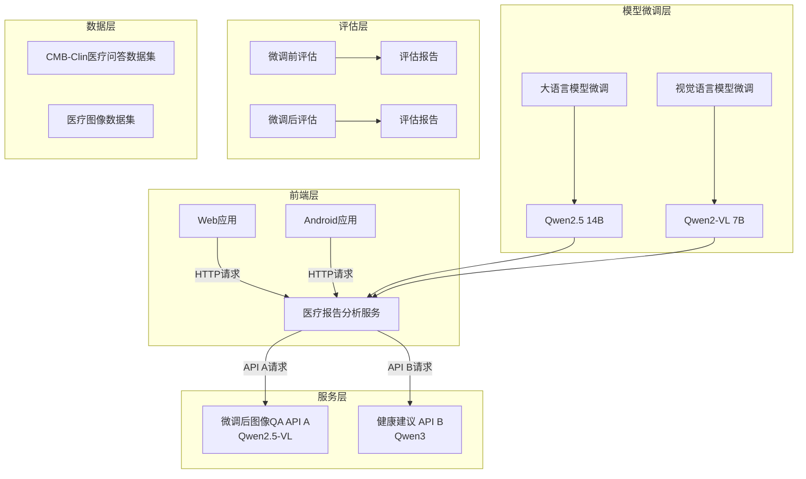
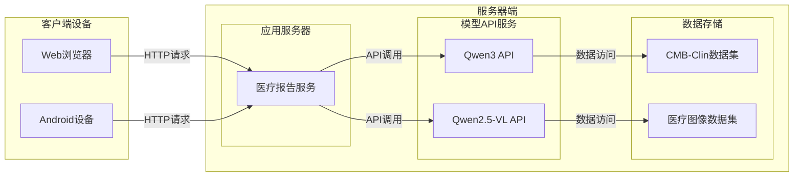
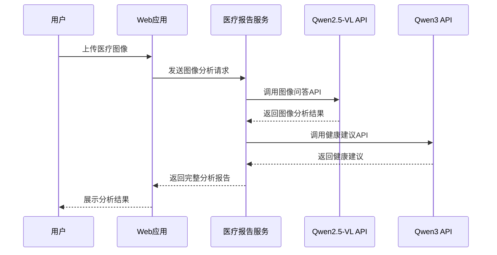
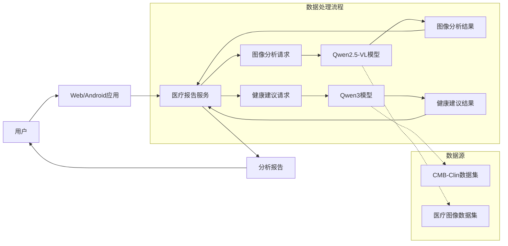

# 大模型微调课程项目 - 健康助手

医疗领域的大模型微调与应用开发，涵盖环境初始化到前端应用开发的全流程

## 项目特点

1. **完整的微调流程**: 从数据准备、模型微调、模型评估、模型服务部署的全流程
2. **医疗领域专用**: 专注于医疗领域的问答和图像分析
3. **多模型支持**: 支持大语言模型和视觉语言模型的微调
4. **端到端应用**: 包含可用于移动端和桌面端的响应式 Web 应用
5. **评估体系**: 提供微调前后的模型评估对比

## 项目结构

项目按照实施顺序分为以下步骤：

1. [0-env-init](0-env-init) - 环境初始化
   - 包含在不同平台（AutoDL、CloudStudio）上的环境初始化脚本和说明

2. [1-eval-data-prepare](1-eval-data-prepare) - 评估数据准备
   - 包含医疗领域问答数据集 CMB-Clin（Chinese-Medical-Benchmark）的数据处理脚本

3. [2-eval-before-tuning](2-eval-before-tuning) - 微调前评估
   - 包含对原始模型进行评估的脚本和结果

4. [3-fine-tuning-llm](3-fine-tuning-llm) - 大语言模型微调
   - 包含针对医疗领域的大语言模型微调的步骤和脚本

5. [4-eval-after-tuning](4-eval-after-tuning) - 微调后评估
   - 包含对微调后模型进行评估的脚本和结果

6. [5-build-server](5-build-server) - 服务构建
   - 包含提供模型服务的服务器代码

7. [6-fine-tuning-vl](6-fine-tuning-vl) - 视觉语言模型微调
   - 包含针对医疗图像的视觉语言模型微调脚本和相关工具

8. [7-endpoint-integration-server](7-endpoint-integration-server) - 端点集成服务
   - 包含医疗报告服务端点集成和测试客户端

9. [8-frontend-apps](8-frontend-apps) - 前端应用
   - 包含健康助手的 Web 应用

## 系统架构

## 部署图

以下部署图展示了项目在服务器和客户端的部署情况：

## 时序图

以下时序图展示了用户通过Web应用请求医疗图像分析的完整流程：

## 数据流图

以下数据流图展示了数据在系统中的流动过程：

## 技术栈

- **模型微调**: Qwen2.5, Unsloth
- **视觉语言模型微调**: Qwen2-VL, Unsloth
- **后端**: Python, Flask
- **前端**: 
  - Web: HTML, CSS, JavaScript
- **评估**: EvalScope

## 使用说明

按照目录顺序逐步执行项目，每个目录都有其特定的功能和依赖关系。   
   
建议按照数字顺序（0, 1, 2, ...）依次完成各步骤。

## 注意事项

- 执行前请确保已按照[0-env-init](0-env-init)目录中的说明完成环境配置
- 某些步骤可能需要大量的计算资源，需要在有GPU的环境下运行
- 各步骤之间存在依赖关系，请按顺序执行

## 项目截图

### 服务端集成界面

### 前端应用界面

#### 主界面和图片选择

#### 上传图片和等待动画

#### 分析结果展示

## 参考资料

1. [上海交大人工智能学院论文：Towards Evaluating and Building Versatile Large Language Models for Medicine](https://arxiv.org/pdf/2408.12547)
2. [上海交大人工智能学院智慧医疗团队在开源大语言模型的临床任务测评与对齐研究中取得新进展](https://news.sjtu.edu.cn/jdzh/20250304/207662.html)
3. [MedBench: 所有医学相关任务的综合基准](https://medbench.opencompass.org.cn/home)